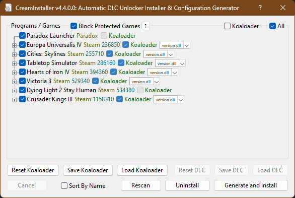

> [!IMPORTANT]
> This repository is a project created purely for educational and technical purposes.

>  I do not condone or support the use of this tool for any illegal activities. I have never used CreamAPI in any capacity, nor do I encourage or promote its use in any way that violates the terms of service of Steam, Epic Games, or any other platform. 
 I am not responsible for any misuse or legal consequences that arise from using this project. It is your responsibility to ensure you comply with all applicable laws and platform terms.
Use this repository at your own risk.

> [!NOTE]
> Easy to get and use Cream API for Steam, Epic and Ubisoft games
>  
> Automatically detects all games, along with their DLC-related DLL files.

> [!WARNING]
> ## TO RUN:
> 
> > ###  UNZIP .dll file   
 unzip $${\color{gold}unzipTHIS.zip}$$ to main folder  
> > > The reason for this is only to reduce size of directoy.
> 
>
>
> > ###  RUN EXE 
 $${\color{gold}CreamInstaller-debug.exe}$$ 

